# Implementation-of-Logistic-Regression-Model-to-Predict-the-Placement-Status-of-Student

## AIM:
To write a program to implement the the Logistic Regression Model to Predict the Placement Status of Student.

## Equipments Required:
1. Hardware – PCs
2. Anaconda – Python 3.7 Installation / Jupyter notebook

## Algorithm
1. 
2. 
3. 
4. 

## Program:
```
/*
Program to implement the the Logistic Regression Model to Predict the Placement Status of Student.

Developed by: Ritika S
Register Number:  212221240046

import pandas as pd
data=pd.read_csv('Placement_Data.csv')
data.head()


data1=data.copy()
data1=data1.drop(["sl_no","salary"],axis = 1)#removes the specified row or column
data1.head()


data1.isnull().sum()


data1.duplicated().sum()


from sklearn.preprocessing import LabelEncoder
le=LabelEncoder()
data1["gender"] = le.fit_transform(data1["gender"])
data1["ssc_b"] = le.fit_transform(data1["ssc_b"])
data1["hsc_b"] = le.fit_transform(data1["hsc_b"])
data1["hsc_s"] = le.fit_transform(data1["hsc_s"])
data1["degree_t"] = le.fit_transform(data1["degree_t"])
data1["workex"] = le.fit_transform(data1["workex"])
data1["specialisation"] = le.fit_transform(data1["specialisation"])
data1["status"] = le.fit_transform(data1["status"])
data1


x=data1.iloc[:,:-1]
x


y=data1["status"]
y


from sklearn.model_selection import train_test_split
x_train,x_test,y_train,y_test=train_test_split(x,y,test_size = 0.2,random_state = 0)


from sklearn.linear_model import LogisticRegression
lr = LogisticRegression(solver = "liblinear")# a library for large
lr.fit(x_train,y_train)
y_pred = lr.predict(x_test)
y_pred


from sklearn.metrics import accuracy_score
accuracy = accuracy_score(y_test,y_pred)
(accuracy)


from sklearn.metrics import confusion_matrix
confusion = confusion_matrix(y_test,y_pred)
(confusion)


from sklearn.metrics import classification_report
classification_report1 = classification_report(y_test,y_pred)
print(classification_report1)


lr.predict([[1,80,1,90,1,1,90,1,0,85,1,85]])
*/  

```

## Output:
### 1.Placement data
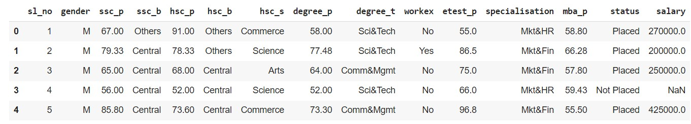

### 2.Salary data
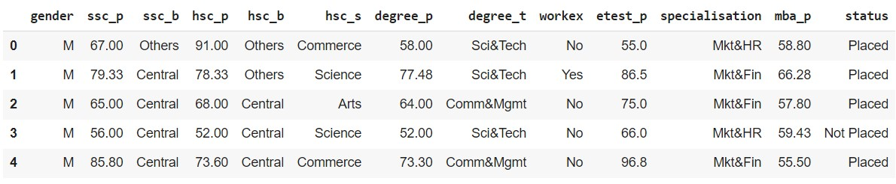

### 3.Checking the null() function
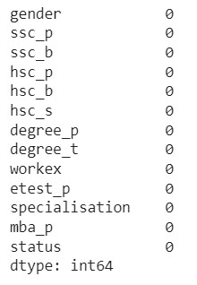

### 4. Data Duplicate
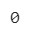

### 5. Print data
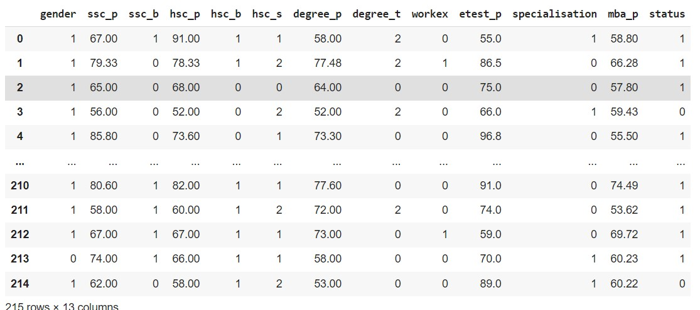

### 6. Data-status
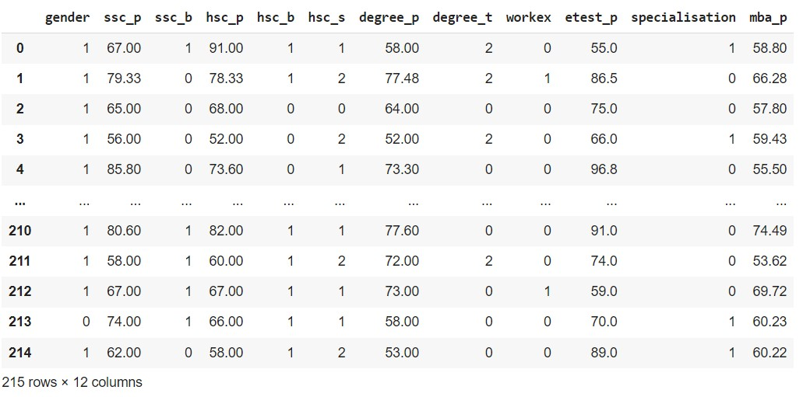
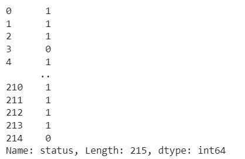

### 7. y_prediction array
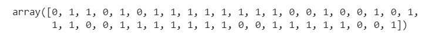

### 8.Accuracy value
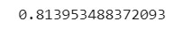

### 9. Confusion array


### 10. Classification report
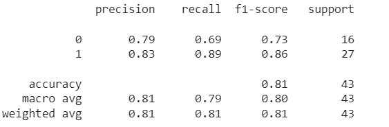

### 11.Prediction of LR

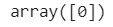


## Result:
Thus the program to implement the the Logistic Regression Model to Predict the Placement Status of Student is written and verified using python programming.
